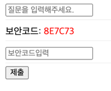
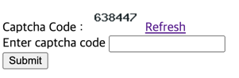

# PHP CAPTCHA

개인적으로 현재까진 3번이 가장 괜찮은듯

## blog post

### 1

- page: http://localhost/php/captcha/1/joinForm.php
- ref: https://beautifulhill.tistory.com/4

### 2

- page: http://localhost/php/captcha/2/index.php
- ref: https://www.redinfo.co.kr/post/view/208

### 3

- page: http://localhost/php/captcha/3/index.php
- ref: https://blog.naver.com/PostView.nhn?blogId=bgpoilkj&logNo=221136359001

### 4

- page: http://localhost/php/captcha/4/index.php
- ref: https://jh-tr.tistory.com/42#google_vignette

### 5

- page:
- ref: https://blog.naver.com/PostView.naver?blogId=oralol&logNo=222645019182&categoryNo=121&parentCategoryNo=0

## youtube

### 6

- page:
- ref: https://www.youtube.com/watch?v=3UZoVrc9A3o

### 7

- page: http://localhost/php/captcha/7/index.php
- ref: https://www.youtube.com/watch?v=S4pnDZJHvvA

### 8

- page: http://localhost/php/captcha/8/form.php
- ref: https://www.youtube.com/watch?v=P_-sAZCmOqU
